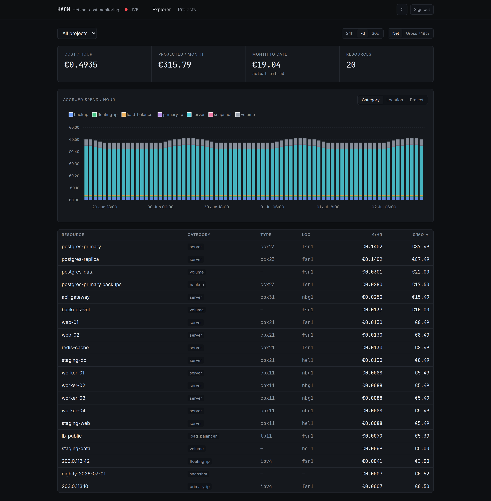
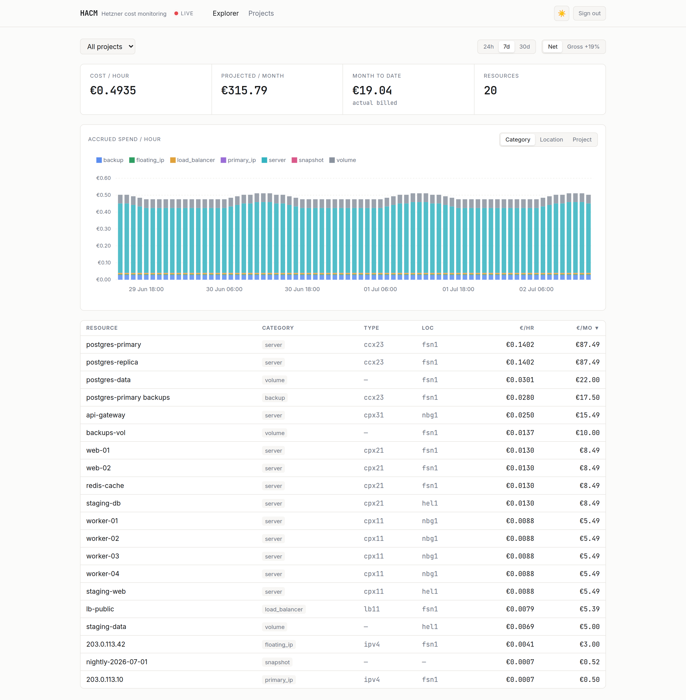
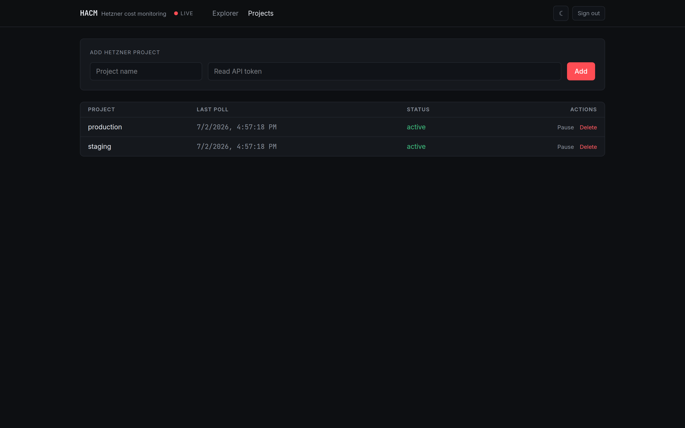

# Hetzner Advanced Cost Monitoring (HACM)

A self-hostable **cost explorer for Hetzner Cloud** — the AWS/GCP-style spend
dashboard Hetzner doesn't ship. A background collector polls the Hetzner Cloud
API every 10 seconds, prices every live resource against the official
`/v1/pricing` rate card, and books each resource-hour into a billing ledger so
you get accurate current burn **and** historical spend, broken down by project,
resource type, and location.

- **Live burn** — €/hour and projected €/month across every project.
- **Month-to-date** — actual accrued spend, correct for autoscaling: Hetzner
  bills a full hour the instant a server exists, so a burst node that lives two
  seconds still counts as one billed hour. HACM books hours the same way.
- **Cost explorer** — accrued-spend-per-hour chart, grouped by category /
  location / project, plus a sortable per-resource breakdown. Net or gross (VAT).
- **Multi-project** — add any number of Hetzner API tokens; filter and aggregate.

Covers Hetzner **Cloud**: servers (incl. backups & traffic overage), volumes,
load balancers, primary & floating IPs, and snapshots. Costs are computed
estimates (`live inventory × /v1/pricing`), not scraped invoices.

## Screenshots



<p align="center">
  
  
</p>

<sub>Screenshots use seeded demo data — try it yourself with
`DB_PATH=./demo.db APP_SECRET=demo DISABLE_COLLECTOR=true bun scripts/seed-demo.ts`
(login `admin@demo.hacm` / `demodemo`).</sub>

## Stack

Bun · Hono (folder-based routing, OpenAPI) · SQLite + Drizzle · TanStack React
(Router + Query) with a generated hey-api client. Design: **Ledger** — monospace
tabular figures, hairline-ruled panels, one accent, light/dark following the OS.

```
server/   Bun + Hono API + 10s collector          (SQLite, Drizzle)
web/      Vite + TanStack React cost explorer      (generated OpenAPI client)
```

## Quick start (development)

```bash
# 1. API
cd server
bun install
cp .env.example .env            # set APP_SECRET=$(openssl rand -hex 32)
bun run dev                     # http://localhost:3000  · docs at /api/docs

# 2. Web (separate shell)
cd web
bun install
bun run dev                     # http://localhost:3001  (proxies /api -> :3000)
```

Open http://localhost:3001, create the admin account (first run only), then add
a Hetzner **read** API token under **Projects**. Costs appear within one poll.

Regenerate the typed API client after changing backend routes: `cd web && bun run openapi`
(backend must be running).

## Deployment

### Docker (single container)

The image builds the frontend and serves it from the same Bun process as the
API — one container, one port.

```bash
docker build -t hacm .
docker run -d --name hacm \
  -p 3000:3000 \
  -e APP_SECRET=$(openssl rand -hex 32) \
  -e COOKIE_SECURE=true \
  -v hacm-data:/data \
  hacm
```

### docker compose

```bash
echo "APP_SECRET=$(openssl rand -hex 32)" > .env
docker compose up -d            # http://localhost:3000
```

The SQLite database lives on the `/data` volume — **back it up** to keep history.
Put the container behind a TLS-terminating reverse proxy (Caddy / Traefik /
nginx) and keep `COOKIE_SECURE=true` in production. It's an admin tool; front it
with your own network controls (VPN / IP allowlist / SSO proxy) as appropriate.

### Bare metal

```bash
cd web && bun install && bun run build
cd ../server && bun install
cp -r ../web/dist ./public       # server auto-serves ./public when present
APP_SECRET=... COOKIE_SECURE=true bun index.ts
```

## Configuration

Server env (all optional except `APP_SECRET`):

| Var | Default | Purpose |
|-----|---------|---------|
| `APP_SECRET` | — (**required**) | Key that encrypts stored Hetzner tokens (AES-256-GCM). `openssl rand -hex 32`. |
| `DB_PATH` | `./hacm.db` | SQLite file (`/data/hacm.db` in Docker). |
| `PORT` | `3000` | HTTP port. |
| `COOKIE_SECURE` | `false` | Set `true` behind HTTPS. |
| `POLL_INTERVAL_MS` | `10000` | How often infra state is polled. |
| `PRICING_TTL_MS` | `3600000` | How often the `/v1/pricing` rate card is refreshed. |

## How cost is computed

1. Every `POLL_INTERVAL_MS`, list all resources per project and match each to its
   `/v1/pricing` rate **at its location** (US regions cost ~3× EU — location matters).
2. Servers add a backup surcharge (if enabled) and per-TB traffic overage.
   Volumes/snapshots price per GB-month; IPs and load balancers per their rate.
3. Live inventory drives current €/hr and projected €/mo. Separately, each
   resource seen in a given clock-hour books one row in a billing ledger — that
   ledger is the source of truth for month-to-date and the spend chart, and is
   accurate for short-lived/autoscaled servers.

All figures are **net**; the UI toggles gross using the account's VAT rate.

## Security

- Hetzner tokens are encrypted at rest with `APP_SECRET`; use **read-only** tokens.
- Single admin account; registration closes after the first user is created.
- Sessions are httpOnly cookies. This is an internal admin tool — do not expose
  it to the public internet without additional access control.

## License

MIT — see [LICENSE](LICENSE).
